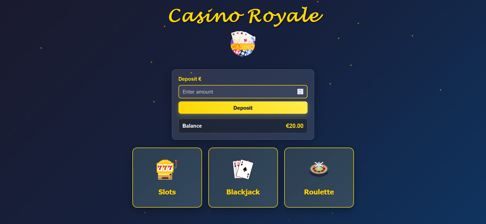
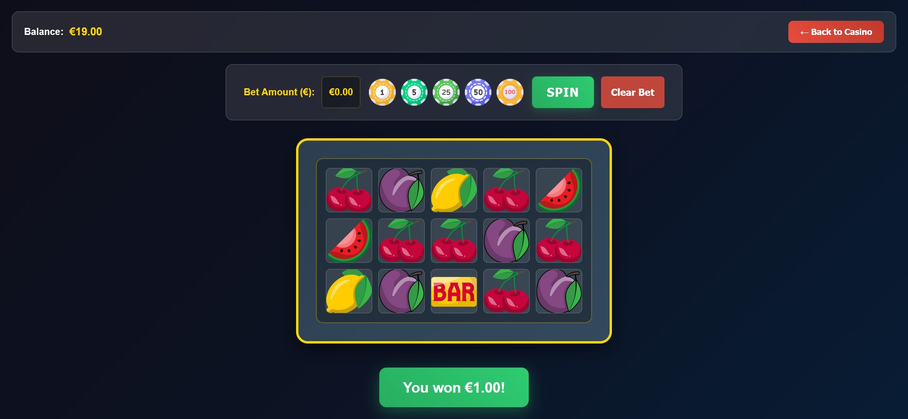
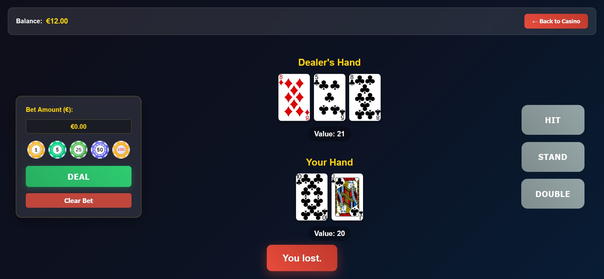
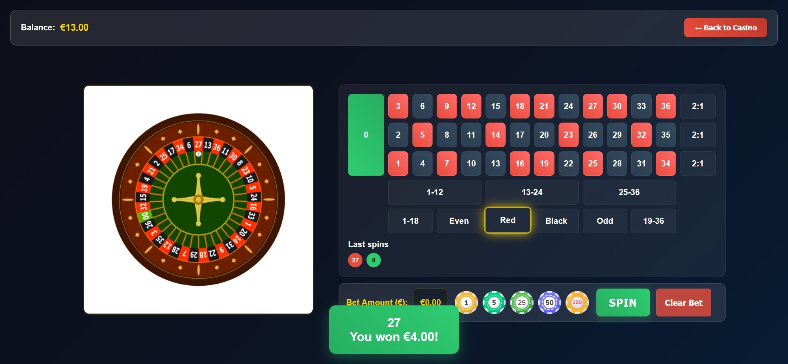

# Casino Web Application

An interactive, multi-game casino web application built with vanilla JavaScript, HTML5, and CSS3. 

---

## Featured Games
- **Slots:** A 3x5 grid slot machine with custom win patterns and weighting.
- **Blackjack:** Full game logic including Hit, Stand, and Double.
- **Roulette:** European-style roulette with a chip-betting system.

---

## Technical Highlights
- **Object-Oriented Programming:** Each game is encapsulated within its own JavaScript Class.
- **State Persistence:** Uses `sessionStorage` and URL parameters to keep the user's balance consistent across different pages.
- **Dynamic UI:** Features a custom preloader, floating particle animations, and responsive CSS layouts.
- **Visuals & Audio:** Integrated sound effects and image-based chip systems for an immersive experience.

---

## Screenshots

Home

Slots

Blackjack

Roulette

